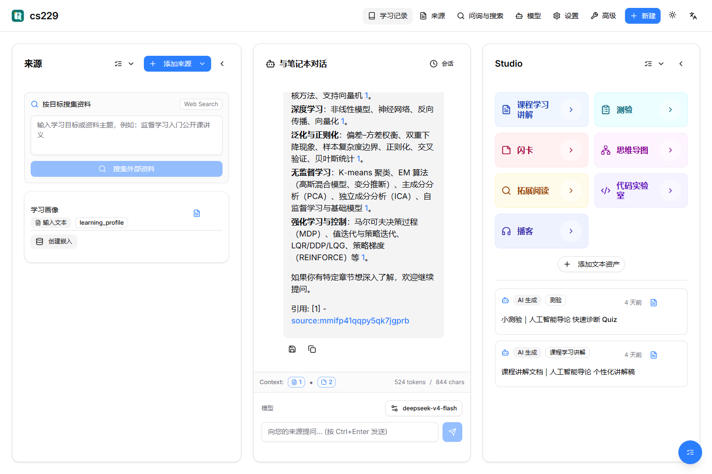
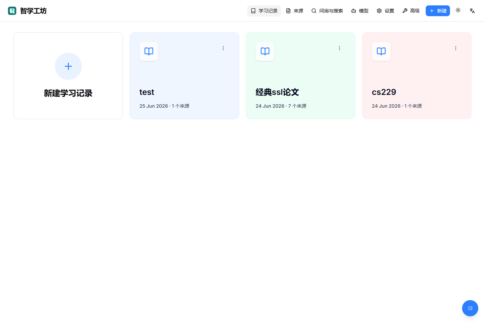
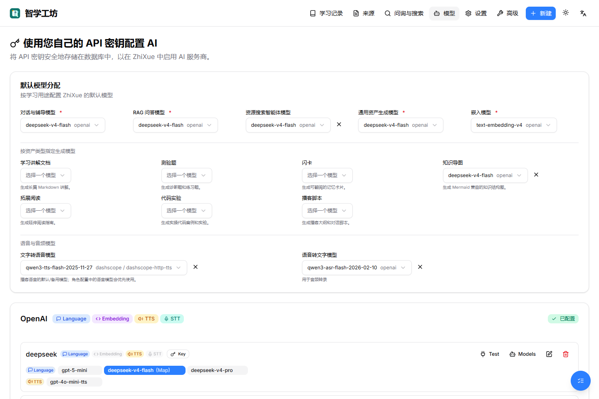
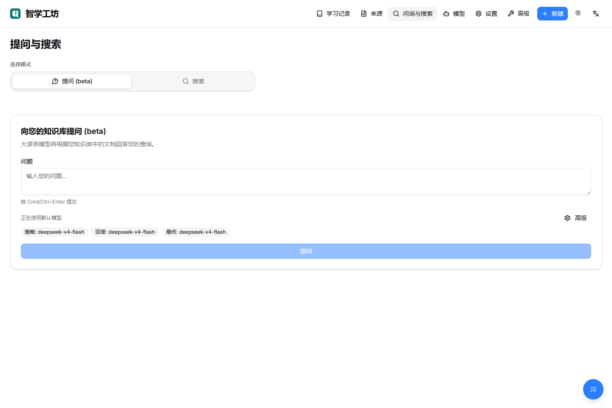

# 知学工坊 ZhiXue

知学工坊是面向“基于大模型的个性化资源生成与学习多智能体系统开发”赛题的 Web 应用。项目在成熟的 AI notebook 开源底座上开发，保留其资料管理、笔记、RAG 问答、模型配置、数据库与前后端工程能力，同时围绕赛题主题做了大幅产品化改造：从通用、偏被动的 notebook，升级为面向高校课程学习的主动式多智能体学习系统。

核心变化不是简单换名或换皮，而是把 notebook 的“资料容器”能力扩展为“学习画像 + 多智能体协作 + 个性化资源生成 + 学习路径规划 + 评估反馈”的闭环。

## 赛题定位

- 目标用户：高校学生，尤其是计算机、人工智能、电子信息等专业课程学习场景。
- 典型痛点：课程资料分散、资源质量参差不齐、学习进度和知识基础差异大、缺少即时个性化指导。
- 产品形态：可运行的 Web 学习工作台，支持课程资料导入、对话式学习画像、资源搜集、多模态学习资产生成、路径推荐和学习效果反馈。
- 开发策略：基于 notebook 底座降低工程风险，把主要创新集中在赛题所需的主动学习、多智能体编排、资源个性化和安全可控生成。

## 赛题要求对齐

| 赛题要求 | 知学工坊实现 |
| --- | --- |
| 对话式学习画像自主构建 | 在每个学习记录中维护“学习画像”来源，支持从自然语言输入、学习行为、资源使用和练习反馈中持续更新画像。画像覆盖专业背景、学习目标、知识基础、认知风格、易错点、资源偏好、学习进度等不少于 6 个维度。 |
| 多智能体协同资源生成 | 设计画像、课程、资源搜索、资产生成、练习、路径规划、辅导、评估、安全等角色，围绕同一学习目标协作。支持讲解文档、测验、闪卡、思维导图、拓展阅读、代码实验、播客等至少 5 类资源。 |
| 个性化学习路径规划和资源推送 | 根据画像、课程内容、已接受来源、薄弱点和学习事件生成下一步学习顺序，并在 Studio 区域按类型展示可用资源。 |
| 智能辅导加分项 | 保留并强化 notebook 内的来源约束问答，在学习页中结合 RAG、引用和上下文 token 预算进行即时答疑。 |
| 学习效果评估加分项 | 通过学习事件、测验/资产使用反馈更新画像，并为后续资源推送和路径规划提供依据。 |
| 防幻觉与内容安全 | 独立安全质检角色检查来源一致性、敏感内容和输出质量；生成内容优先绑定可追溯来源和引用。 |
| 生成进度追踪或流式呈现 | 支持 SSE 流式编排事件和后台 command job；前端有任务浮窗，展示排队、运行、失败、日志和结果摘要。 |
| 界面与交互 | Next.js 工作台界面，Markdown 渲染、多模态内容卡片、模型设置、资源搜索和 Studio 资产入口集中展示。 |

## 实际运行截图

以下截图来自本地实际运行环境：前端 `http://127.0.0.1:8504`，API `http://127.0.0.1:5055`，时间为 2026-06-28。

### 学习工作台



### 学习记录列表



### 模型与 API 配置



### 问询与搜索智能体入口



## 多智能体设计

系统采用“角色分工 + 共享学习上下文 + 可观测任务状态”的多智能体协作方式。每个智能体并不是孤立聊天机器人，而是在同一个学习记录、资料库、画像和模型配置之上协同工作。

| 智能体 | 职责 |
| --- | --- |
| 画像智能体 | 从学生对话、课程目标、历史事件中提取画像维度，并把变化写回学习画像。 |
| 课程智能体 | 拆解课程目标、知识点、先修关系、学习难度和阶段性任务。 |
| 资源搜索智能体 | 根据学习目标和短板规划检索，搜集候选资料，供学生确认后纳入上下文。 |
| 资产生成智能体 | 基于画像和已接受来源生成讲解文档、导图、阅读材料等学习资产。 |
| 练习智能体 | 生成测验、闪卡、代码实验和实践任务，并记录练习反馈。 |
| 路径规划智能体 | 把资源、练习和学生进度组织为动态学习步骤。 |
| 辅导智能体 | 在学习过程中提供来源感知的问答解释。 |
| 评估智能体 | 分析学习行为、练习结果和资源反馈，调整推荐策略。 |
| 安全智能体 | 检查幻觉风险、来源一致性、敏感内容和输出质量。 |

## 技术亮点

- 以 notebook 为知识底座：复用资料导入、来源管理、笔记、RAG、引用、模型和数据库能力，把通用资料库改造成课程学习空间。
- 模型用途化管理：不仅按供应商配置模型，还按聊天、RAG、资源搜索、学习资产、讲解、测验、闪卡、导图、阅读、代码实验、播客、Embedding、TTS、STT 等用途设置默认模型。
- 多协议模型适配：支持 OpenAI、OpenAI-compatible、DashScope、Azure/OpenAI 等协议归一；TTS 管线额外区分 DashScope HTTP TTS、realtime TTS、语音克隆/配音模型，避免把不适合的模型用于普通播客 TTS。
- 来源约束生成：学习资产优先基于已接受来源和语义索引生成，减少“看似合理但不可追溯”的内容。
- 任务可观测：长任务走 command job，前端任务浮窗可显示状态、日志、失败原因和结果摘要，适合演示多智能体流程。
- 多模态资源形态：文本讲解、结构化题目、闪卡、思维导图、拓展阅读、代码实验、播客音频脚本/TTS 管线共同组成资源池。
- 安全与可控：API key 加密存储，内容生成有安全检查角色，文档中明确开源来源、协议和 AI Coding 工具使用边界。

## 主要目录

```text
api/                         FastAPI 路由与学习服务
commands/                    surreal-commands 后台任务
frontend/                    Next.js 前端工作台
open_notebook/               notebook 底座与 AI/数据库/播客等核心模块
open_notebook/ai/model_specs.py
                             多协议模型 spec 与 TTS 协议判断
open_notebook/utils/semantic_index.py
                             轻量语义索引与资源检索辅助
docs/                        比赛文档与截图
tests/                       后端和学习系统单元测试
```

底层 Python 包名仍保留 `open_notebook`，部分环境变量仍沿用 `OPEN_NOTEBOOK_*`。这是为了兼容原底座的数据模型、迁移和运行时配置，不代表产品仍是原通用 notebook。

## 本地运行

后端：

```bash
uv run python run_api.py
```

前端：

```bash
cd frontend
npm install
npm run dev
```

Docker：

```bash
docker compose up -d --build
```

默认访问地址：

- 前端：`http://localhost:8502`
- API：`http://localhost:5055`
- 数据库：`http://localhost:8000`

## 演示流程

1. 创建一个课程学习记录，例如“人工智能导论”或“机器学习基础”。
2. 上传课程讲义、论文、网页或笔记材料，形成初始知识库。
3. 在学习画像区输入学生背景、目标、薄弱点和偏好。
4. 使用“按目标搜集资料”让资源搜索智能体给出候选外部资料。
5. 在 Studio 中生成课程学习讲解、测验、闪卡、思维导图、拓展阅读、代码实验和播客。
6. 观察任务浮窗和生成日志，展示多智能体协作进度。
7. 通过问答、测验反馈或资产使用事件更新画像，再生成下一阶段学习路径。

## 配套文档

- [需求分析说明](docs/requirements-analysis.md)
- [系统开发说明](docs/system-design.md)
- [测试说明](docs/testing.md)
- [部署与演示指南](docs/deployment-and-demo.md)
- [开源与 AI 工具说明](docs/open-source-and-ai-tools.md)

## 验证状态

最近一次本地验证：

- `pytest tests/test_credentials_api.py tests/test_models_api.py tests/test_learning_api.py tests/test_learning_service.py tests/test_semantic_index.py tests/test_command_service.py -q`：55 passed
- `npm run lint`：0 errors，存在少量既有 warning
- `npm run build`：通过
- `docker compose build zhixue`：Dockerfile 已加入 apt retry；当前环境遇到 Debian apt 源 502，属于外部包源问题，非应用代码编译错误。
