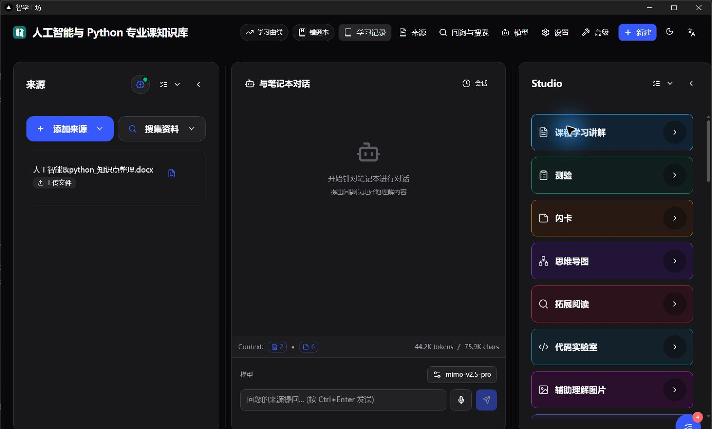
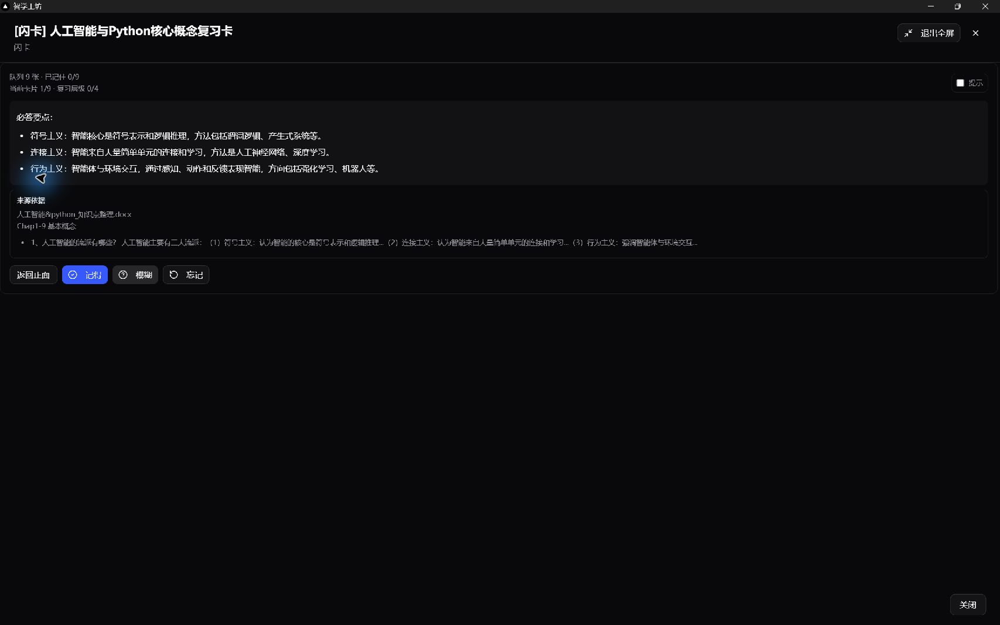
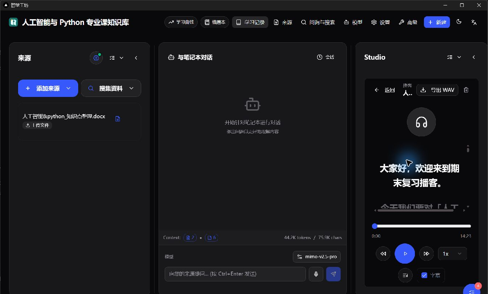

# ForgeNote

[English](README.en.md) | **简体中文**

ForgeNote 是一款面向高校专业课学习的本地 AI 桌面应用。它把课程讲义、论文、网页与个人笔记整理为可追溯的知识库，并据此生成讲解、测验、闪卡、思维导图、代码实验、拓展阅读和播客。



## 核心能力

- **课程知识库**：导入 PDF、Word、网页、音频和文本，完成解析、分块、检索与来源管理。
- **来源约束问答**：围绕已选资料提问，保留上下文与引用，减少脱离材料的回答。
- **学习资产生成**：按同一课程上下文生成讲解、测验、闪卡、导图、阅读材料、代码实验和图片。
- **个性化学习闭环**：结合学习画像、测验结果、错题和学习事件调整后续内容与学习路径。
- **可观测长任务**：解析、生成与播客任务统一进入悬浮任务球；额度、鉴权或模型错误会明确显示，不会静默回退。
- **本地桌面体验**：Windows 安装包内置后端、前端、数据库与 FFmpeg，在独立 WebView2 窗口中运行。

## 真实课程演示

仓库提供一套可复现的高校专业课系统测试数据，以 [人工智能&python_知识点整理.docx](docs/demo/人工智能&python_知识点整理.docx) 为主资料，在当前桌面 App 中建立“人工智能与 Python 专业课知识库”。它适合作为人工智能、计算机与电子信息相关课程的功能验证基线。

| 课程模块 | 覆盖内容 |
| --- | --- |
| Python 与数据处理 | 语法基础、NumPy、数据表示与编程实践 |
| 机器学习 | 线性/逻辑回归、KNN、K-means、朴素贝叶斯 |
| 神经网络 | 全连接网络、CNN、参数计算与 Keras 实践 |
| 知识与推理 | 谓词逻辑、语义网络、框架表示、可信度推理 |
| 搜索与优化 | 状态空间、启发式搜索、A* 与遗传算法 |

测试知识库已经实际生成测验、9 张结构化闪卡、思维导图、代码实验、课程讲解、拓展阅读与中文播客。完整清单和复现建议见 [演示数据说明](docs/demo/README.md)，播客成品可直接 [试听或下载 MP3](docs/demo/人工智能与Python专业课知识库-播客.mp3)。

### 闪卡复习



### 中文播客



演示播客使用 `mimo-v2.5-pro` 生成大纲与讲稿，使用 `mimo-v2.5-tts` 合成语音；这些模型可在设置页替换。仓库不包含任何 API key。

## 快速开始

### Windows 桌面安装包（推荐）

从 [Releases](../../releases/latest) 获取 `ForgeNote-Setup-0.1.5.exe`，双击安装后从桌面或开始菜单启动 ForgeNote。安装包不要求预装 Docker、Python 或 Node.js；旧版本可以直接覆盖升级。

首次使用时，在“模型”页面添加供应商凭据，再在“设置”页面选择通用文本、Embedding、图片、TTS、STT 及各类学习资产使用的模型。详细步骤见 [配置指南](docs/configuration-guide.md)。

自行构建安装包：

```powershell
powershell -ExecutionPolicy Bypass -File .\desktop\windows\build.ps1
```

输出位于 `dist/windows/ForgeNote-Setup-0.1.5.exe`，打包与数据目录说明见 [Windows 打包文档](desktop/windows/README.md)。

### 浏览器运行（Docker，推荐）

如果希望在 Chrome、Edge、Safari 等浏览器中使用 ForgeNote，而不是安装 Windows 桌面版，最简单的方式是用 Docker 同时启动数据库、API、后台任务 worker 和 Web 前端。

1. 在项目根目录准备配置。复制示例文件后，至少修改 `FORGENOTE_ENCRYPTION_KEY`、`SURREAL_USER` 和 `SURREAL_PASSWORD`；这些值投入使用后应保持不变。

```powershell
Copy-Item .env.example .env
```

2. 构建并启动服务：

```powershell
docker compose up -d --build
docker compose ps
```

3. 等待 `forgenote` 和 `surrealdb` 进入运行状态，然后打开：

- Web 界面：`http://localhost:8502`
- API 文档（仅调试时需要）：`http://localhost:5055/docs`

查看启动日志或停止服务：

```powershell
docker compose logs -f forgenote
docker compose down
```

上传内容和应用数据分别保存在项目根目录的 `notebook_data/` 与 `surreal_data/`，普通的 `docker compose down` 不会删除它们。Docker 构建依赖 Docker Hub、Debian 和 npm 等外部源；网络受限的 Windows 环境建议使用桌面安装包。

#### 从其他设备访问

- 局域网直连：访问 `http://<服务器 IP>:8502`，并在防火墙中只向可信网络开放 `8502` 和 `5055`。数据库端口 `8000` 不应对外开放。
- 公网或 HTTPS：推荐只把反向代理的 `443` 端口暴露到公网，并将流量转发到 `127.0.0.1:8502`。在 `.env` 中设置同源地址：

```dotenv
API_URL=https://forgenote.example.com
INTERNAL_API_URL=http://localhost:5055
```

`API_URL` 是浏览器访问的公开地址；`INTERNAL_API_URL` 是 Next.js 在容器内部访问 API 的地址。这样浏览器请求 `/api/*` 时会由 Web 服务转发到内部 API，无需公开 `5055`。反向代理需要保留 `Host` 和 `X-Forwarded-Proto` 请求头；长时间生成与流式响应建议关闭代理缓冲并延长读取超时。示例 Nginx 站点配置如下，TLS 证书部分请按实际环境补充：

```nginx
server {
    listen 443 ssl;
    server_name forgenote.example.com;

    location / {
        proxy_pass http://127.0.0.1:8502;
        proxy_http_version 1.1;
        proxy_set_header Host $host;
        proxy_set_header X-Forwarded-Proto $scheme;
        proxy_set_header X-Forwarded-For $proxy_add_x_forwarded_for;
        proxy_buffering off;
        proxy_read_timeout 3600s;
    }
}
```

公网部署前务必使用随机且稳定的加密密钥、强数据库密码，并通过防火墙或安全组阻止外部访问 `5055` 和 `8000`。更多配置项见 [部署与演示](docs/deployment-and-demo.md) 和 [配置指南](docs/configuration-guide.md)。

### 源码运行（浏览器开发）

源码开发需要分别运行数据库、API、后台 worker 和前端。先准备依赖与数据库：

```powershell
Copy-Item .env.example .env
# 源码运行时将 .env 中的 SURREAL_URL 改为 ws://localhost:8000/rpc
uv sync
docker compose up -d surrealdb
cd frontend
npm ci
cd ..
```

然后分别打开三个终端：

```powershell
# 终端 1：API
uv run --env-file .env python run_api.py

# 终端 2：后台任务 worker
uv run --env-file .env surreal-commands-worker --import-modules commands

# 终端 3：Web 前端
cd frontend
npm run dev
```

开发模式的 Web 界面位于 `http://localhost:3000`，API 位于 `http://localhost:5055`。只启动 API 和前端时，解析、生成、播客等后台任务不会执行，因此不要省略 worker。

## 技术组成

- FastAPI、Next.js、SurrealDB 与后台 command worker
- 来源分块、Embedding、BM25/语义检索和 RAG
- OpenAI、OpenAI-compatible、DashScope、Azure OpenAI 等模型协议适配
- Windows WebView2 桌面壳、PyInstaller、内置 Node.js、SurrealDB 与 FFmpeg

项目运行时命名已统一为 Python 包 `forgenote`、环境变量 `FORGENOTE_*` 和数据库命名空间 `forgenote`。

## 验证

项目包含后端单元测试、前端组件测试、Lint、生产构建、Windows 安装包构建与正式目录冒烟测试。测试范围及命令见 [测试说明](docs/testing.md)。

## 文档

- [需求分析](docs/requirements-analysis.md)
- [系统设计](docs/system-design.md)
- [配置指南](docs/configuration-guide.md)
- [部署与演示](docs/deployment-and-demo.md)
- [开源与 AI 工具说明](docs/open-source-and-ai-tools.md)

ForgeNote 基于开源项目 [Open Notebook](https://github.com/lfnovo/open-notebook) 开发。
