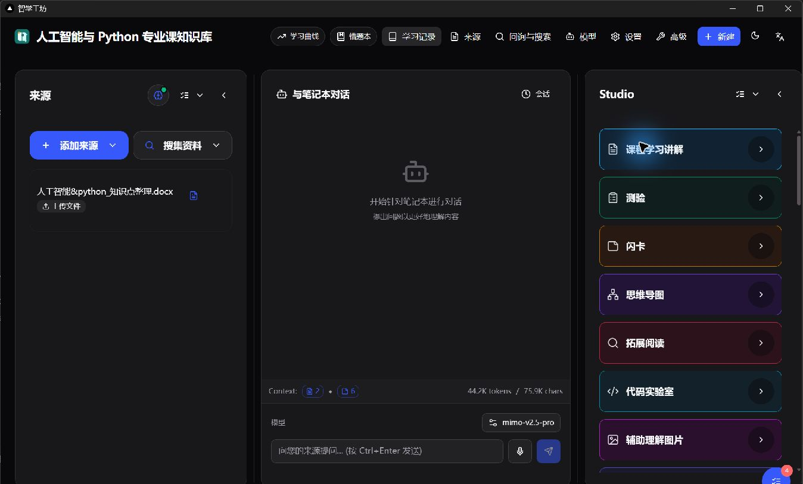
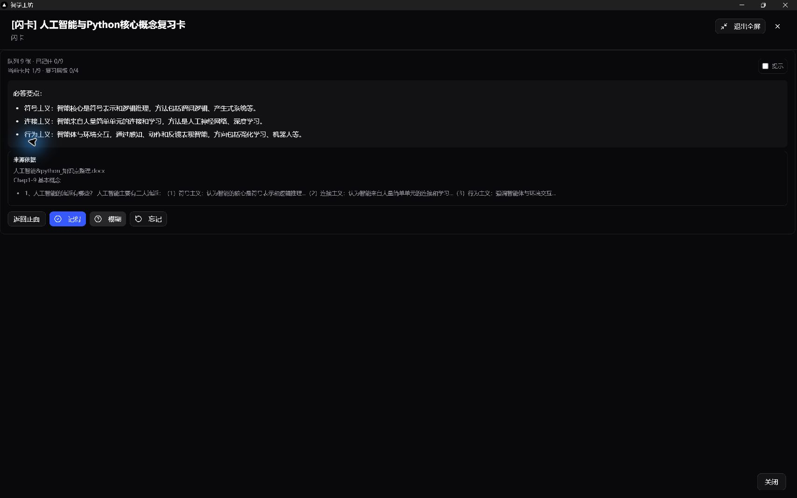
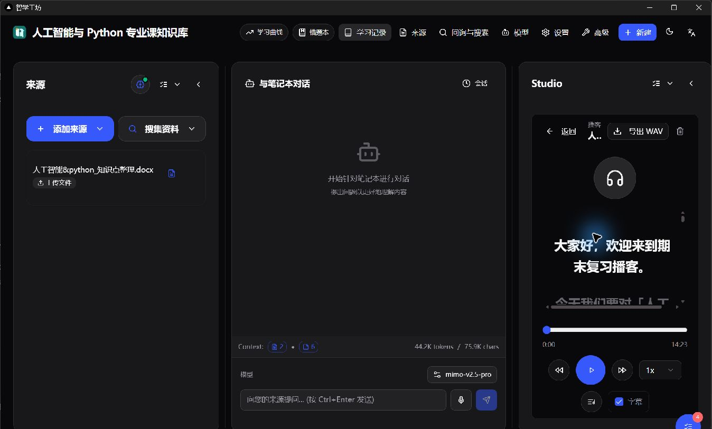

# ForgeNote

[English](README.md) | **简体中文**

ForgeNote 是一款面向高校专业课学习的本地 AI 桌面应用。它把课程讲义、论文、网页与个人笔记整理为可追溯的知识库，并据此生成讲解、测验、闪卡、思维导图、代码实验、拓展阅读和播客。



## 核心能力

- **课程知识库**：导入 PDF、Word、网页、音频和文本，完成解析、分块、检索与来源管理。
- **来源约束问答**：围绕已选资料提问，保留上下文与引用，减少脱离材料的回答。
- **学习资产生成**：按同一课程上下文生成讲解、测验、闪卡、导图、阅读材料、代码实验和图片。
- **个性化学习闭环**：结合学习画像、测验结果、错题和学习事件调整后续内容与学习路径。
- **可观测长任务**：解析、生成与播客任务统一进入悬浮任务球；额度、鉴权或模型错误会明确显示，不会静默回退。
- **本地桌面体验**：Windows 安装包内置后端、前端、数据库与 FFmpeg，在独立 WebView2 窗口中运行。

## 真实课程演示

仓库提供一套可复现的高校专业课系统测试数据，以 [人工智能&python_知识点整理.docx](docs/demo/人工智能&python_知识点整理.docx) 为主资料，在当前桌面 App 中建立“人工智能与 Python 专业课知识库”。它适合作为人工智能、计算机与电子信息相关课程的功能验证基线。

| 课程模块 | 覆盖内容 |
| --- | --- |
| Python 与数据处理 | 语法基础、NumPy、数据表示与编程实践 |
| 机器学习 | 线性/逻辑回归、KNN、K-means、朴素贝叶斯 |
| 神经网络 | 全连接网络、CNN、参数计算与 Keras 实践 |
| 知识与推理 | 谓词逻辑、语义网络、框架表示、可信度推理 |
| 搜索与优化 | 状态空间、启发式搜索、A* 与遗传算法 |

测试知识库已经实际生成测验、9 张结构化闪卡、思维导图、代码实验、课程讲解、拓展阅读与中文播客。完整清单和复现建议见 [演示数据说明](docs/demo/README.md)，播客成品可直接 [试听或下载 MP3](docs/demo/人工智能与Python专业课知识库-播客.mp3)。

### 闪卡复习



### 中文播客



演示播客使用 `mimo-v2.5-pro` 生成大纲与讲稿，使用 `mimo-v2.5-tts` 合成语音；这些模型可在设置页替换。仓库不包含任何 API key。

## 快速开始

### Windows 桌面安装包（推荐）

从 [Releases](../../releases/latest) 获取 `ForgeNote-Setup-0.1.4.exe`，双击安装后从桌面或开始菜单启动 ForgeNote。安装包不要求预装 Docker、Python 或 Node.js；旧版本可以直接覆盖升级。

首次使用时，在“模型”页面添加供应商凭据，再在“设置”页面选择通用文本、Embedding、图片、TTS、STT 及各类学习资产使用的模型。详细步骤见 [配置指南](docs/configuration-guide.md)。

自行构建安装包：

```powershell
powershell -ExecutionPolicy Bypass -File .\desktop\windows\build.ps1
```

输出位于 `dist/windows/ForgeNote-Setup-0.1.4.exe`，打包与数据目录说明见 [Windows 打包文档](desktop/windows/README.md)。

### 源码运行（开发）

```powershell
uv sync
uv run python run_api.py
```

另开终端启动前端：

```powershell
cd frontend
npm install
npm run dev
```

### Docker（可选）

```powershell
docker compose up -d --build
```

Docker 构建依赖 Docker Hub、Debian 和 npm 等外部源；网络受限的 Windows 环境建议直接使用桌面安装包。

## 技术组成

- FastAPI、Next.js、SurrealDB 与后台 command worker
- 来源分块、Embedding、BM25/语义检索和 RAG
- OpenAI、OpenAI-compatible、DashScope、Azure OpenAI 等模型协议适配
- Windows WebView2 桌面壳、PyInstaller、内置 Node.js、SurrealDB 与 FFmpeg

项目运行时命名已统一为 Python 包 `forgenote`、环境变量 `FORGENOTE_*` 和数据库命名空间 `forgenote`。

## 验证

项目包含后端单元测试、前端组件测试、Lint、生产构建、Windows 安装包构建与正式目录冒烟测试。测试范围及命令见 [测试说明](docs/testing.md)。

## 文档

- [需求分析](docs/requirements-analysis.md)
- [系统设计](docs/system-design.md)
- [配置指南](docs/configuration-guide.md)
- [部署与演示](docs/deployment-and-demo.md)
- [开源与 AI 工具说明](docs/open-source-and-ai-tools.md)

ForgeNote 基于开源项目 [Open Notebook](https://github.com/lfnovo/open-notebook) 开发。
